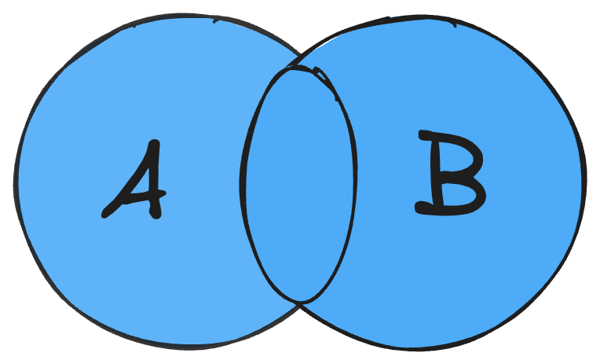

# union

数组取并集。



## 基本用法

传入多个数组，使用[SameValueZero](https://262.ecma-international.org/6.0/#sec-samevaluezero)进行比较，返回含有并集数据的数组。

```ts
import { union } from '@renzp/utils';

union([1, 1, 2, 3], [4, 3]); // [1, 2, 3, 4]
union([1, false, 2], [false, 4, 1])); // [1, false, 2, 4]
union([1, '1', 2, 3], [4, 3, '1'])); // [1, '1', 2, 3, 4]
```

## 对象数组

当数组元素为对象时，默认是直接对比对象的，如果想根据对象的属性来判断的话，可在最后一个参数传入配置项`options.filter`。

```ts
import { union } from '@renzp/utils';

union(
  [
    { a: 1, b: 1 },
    { a: 2, b: 1 },
    { a: 3, b: 1 },
  ],
  [
    { a: 1, b: 1 },
    { a: 2, b: 2 },
    { a: 3, b: 3 },
    { a: 3, b: 2 },
    { a: 4, b: 2 },
  ],
  { filter: 'a' },
); // [{ a: 1, b: 1 }, { a: 2, b: 1 }, { a: 3, b: 1 }, { a: 4, b: 2 }]
```

## 自定义函数

如果当指定对象key进行对比无法满足需求时，可以传给`options.filter`一个函数，函数返回一个`boolean`。

```ts
import { union } from '@renzp/utils';

union(
  [
    { a: 1, b: 1 },
    { a: 2, b: 1 },
    { a: 3, b: 1 },
    { a: 1, b: 1 },
    { a: 2, b: 1 },
    { a: 3, b: 2 },
  ],
  [
    { a: 1, b: 1 },
    { a: 2, b: 1 },
    { a: 3, b: 1 },
    { a: 1, b: 2 },
    { a: 2, b: 3 },
  ],
  { filter: (target, v) => target.a === v.a && target.b === v.b },
); // [{ a: 1, b: 1 }, { a: 2, b: 1 }, { a: 3, b: 1 }, { a: 3, b: 2 }, { a: 1, b: 2 }, { a: 2, b: 3 }]
```

## 参数

| 参数    | 说明     | 类型               | 默认值 | 是否必填 |
| ------- | -------- | ------------------ | ------ | -------- |
| ...args | 目标数组 | `[...Array<T>]`    | -      | 否       |
| options | 配置     | `FilterOptions<T>` | -      | 否       |

### options

| 参数   | 说明          | 类型        | 默认值 | 是否必填 |
| ------ | ------------- | ----------- | ------ | -------- |
| filter | 过滤key或函数 | `Filter<T>` | -      | 否       |

```ts
export type Filter<T> =
  | keyof T
  | Array<keyof T>
  | ((target: T, v: T) => boolean)
```

## 返回

| 参数 | 说明               | 类型       |
| ---- | ------------------ | ---------- |
| list | 含有并集数据的数组 | `Array<T>` |
